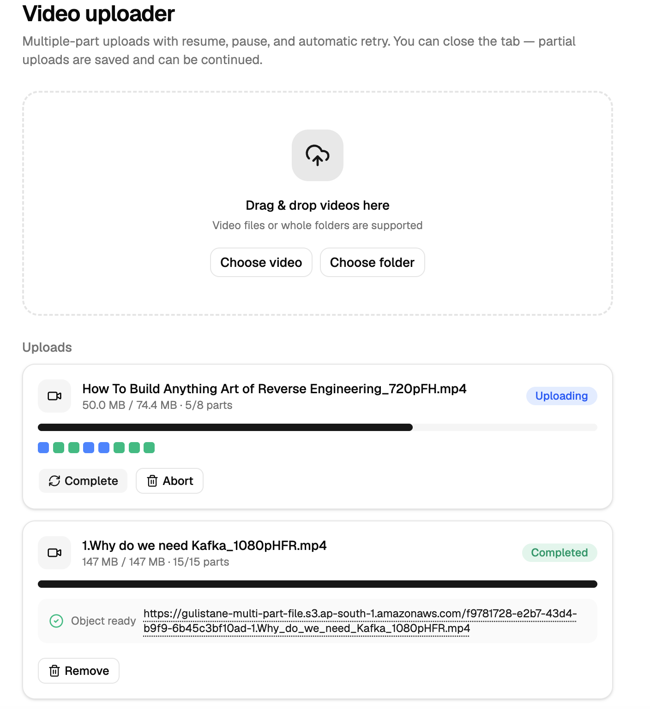

# S3 Multipart Upload

A full-stack **S3 multipart upload** project: an Express backend that brokers multipart uploads to S3, and a React frontend that uploads large video files with resume, pause, retry, and tab-close recovery.

## Screenshot



## Features

- **Multipart uploads to S3** brokered by the backend (presigned URLs, parts, completion, abort).
- **Upload engine in the browser** — 3 parts in parallel, automatic per-part retry (max 3 attempts), pause/resume, and one-click retry of only the failed parts.
- **Resume after closing the tab** — session progress is persisted to `localStorage`; pick the same file again and only missing/failed parts are re-uploaded.
- **Folder upload** — drop or choose a folder and the relative folder structure is preserved in the S3 object key.
- **ETag handling** — reads the ETag header from each part PUT; falls back to a client-side MD5 (via `spark-md5`) if it's missing.
- **Bucket CORS configured** for browser-direct PUTs, with `ETag` exposed.
- **Toasts** (Sonner) for upload started / completed / aborted / resumed / failed.
- **Stale-upload reconciliation** — a node-cron job aborts S3 multipart uploads that were never completed.

## Repository layout

```
.
├── backend/    # Express 5 (ESM) API — brokers S3 multipart uploads
└── frontend/   # React 19 + Vite + TypeScript uploader UI
```

## Prerequisites

- Node.js 20+, pnpm 9.12 (`corepack enable` is enough).
- An AWS account with an S3 bucket and IAM credentials that have `s3:PutObject`, `s3:GetObject`, `s3:AbortMultipartUpload`, and `s3:ListMultipartUploadParts` on that bucket.
- (Optional) PostgreSQL if you want to persist upload records with Prisma.

## Getting started

### 1. Backend

```bash
cd backend
pnpm install
cp .env.example .env     # fill in S3_REGION, S3_BUCKET, S3_ACCESS_KEY, S3_SECRET_KEY, JWT_SECRET
pnpm dev                 # nodemon on http://localhost:3000
```

> Run the backend from inside `backend/` — `.env` is resolved relative to the working directory.

Required env vars — see `backend/.env.example`:

| Var | Purpose |
|---|---|
| `S3_REGION` | Bucket region (e.g. `ap-south-1`). |
| `S3_BUCKET` | Bucket name. |
| `S3_ACCESS_KEY` / `S3_SECRET_KEY` | IAM credentials. |
| `JWT_SECRET` | Long random string for signing tokens. |
| `PORT` | Optional, defaults to `3000`. |
| `CLIENT_URL` | Optional, defaults to `http://localhost:5173` (CORS). |
| `DATABASE_URL` | Optional, only needed for Prisma. |

Optional Prisma setup:

```bash
pnpm prisma:generate
pnpm prisma:migrate
```

### 2. Frontend

```bash
cd frontend
pnpm install
pnpm dev    # Vite on http://localhost:5173 (auto-moves to 5174 if 5173 is taken)
```

Vite proxies `/api` to `http://localhost:3000`, so the frontend talks to the backend with no extra CORS config. The dev server runs on **port 5173** — the S3 bucket CORS allows `http://localhost:5173` and `http://localhost:5174`.

### 3. Bucket CORS (required for browser uploads)

The S3 bucket must allow cross-origin PUTs from the frontend origin and expose the ETag response header. Example applied with the AWS CLI:

```bash
aws s3api put-bucket-cors --bucket YOUR_BUCKET --region YOUR_REGION \
  --cors-configuration '{
    "CORSRules": [{
      "AllowedOrigins": ["http://localhost:5173", "http://localhost:5174", "http://localhost:3000"],
      "AllowedMethods": ["GET", "PUT", "POST", "DELETE"],
      "AllowedHeaders": ["*"],
      "ExposeHeaders": ["ETag", "x-amz-request-id", "x-amz-id-2"],
      "MaxAgeSeconds": 3600
    }]
  }'
```

Without `ExposeHeaders: ["ETag"]` the browser cannot read the ETag returned by S3 after each part PUT, and completion fails.

## How it works

1. The frontend calls `POST /api/v1/upload/initiate-upload` with the file name, size, MIME type, and optional folder path. The backend creates the S3 multipart upload and returns a `documentId`, S3 `uploadId`, object `key`, `partSize`, and `totalParts`.
2. The upload engine slices the file into parts and requests presigned PUT URLs (`POST /:documentId/parts/batch`, refreshed if a batch is older than 9 of its 15-minute validity).
3. Parts are uploaded directly from the browser to S3 (3 at a time, with retries). Each part's `status` and `etag` are persisted after every change.
4. When all parts are `done`, the frontend calls `POST /:documentId/complete` with every part number + ETag; the object becomes available at its `location`.
5. Aborting calls `POST /:documentId/abort`; the backend aborts the S3 upload and marks the record `ABORT`. A cron job (runs hourly) does the same for any upload stuck in `PENDING` past its `expiresAt`.

## API

Base URL: `http://localhost:3000/api/v1`. All responses are `{ success, data }`.

| Method | Path | Auth | Notes |
|---|---|---|---|
| `GET` | `/health` | none | Liveness probe. |
| `GET` | `/ready` | none | Readiness probe (checks DB if configured). |
| `GET` | `/docs` | none | Scalar UI for the live OpenAPI spec. |
| `GET` | `/openapi.json` | none | Raw OpenAPI 3.1 spec. |
| `POST` | `/users/register` | none | Create a user. |
| `POST` | `/users/login` | none | Returns a JWT. |
| `GET` | `/users/me` | Bearer | Current user profile. |
| `GET` | `/users` | Bearer + admin | List all users. |
| `POST` | `/upload/initiate-upload` | none | Start a multipart upload. |
| `POST` | `/upload/:documentId/parts` | none | Presigned PUT URL for one part. |
| `POST` | `/upload/:documentId/parts/batch` | none | Presigned PUT URLs for all parts. |
| `POST` | `/upload/:documentId/complete` | none | Complete the upload (send part numbers + ETags). |
| `POST` | `/upload/:documentId/abort` | none | Abort the upload. |

### Example

```bash
curl -X POST http://localhost:3000/api/v1/upload/initiate-upload \
  -H 'Content-Type: application/json' \
  -d '{"fileName":"testvideo.mp4","contentType":"video/mp4","fileSize":30000000,"folderPath":"videos/trip"}'
```

```json
{
  "success": true,
  "data": {
    "documentId": "0c8f5f74-3a1e-4b2c-9d4d-2f0a6b3c1e2e",
    "uploadId": "2KpqtbQgzTnxmJYZxRCp6F7PuFqQ2lQl",
    "key": "0c8f5f74-3a1e-4b2c-9d4d-2f0a6b3c1e2e-videos/trip/testvideo.mp4",
    "partSize": 10485760,
    "totalParts": 3
  }
}
```

Interactive API docs (Swagger/Scalar) live at `http://localhost:3000/api/v1/docs`.

## Frontend architecture

```
frontend/src/
├── components/
│   ├── UploadPage.tsx      # drop zone, buttons, upload/resume list
│   ├── UploadCard.tsx      # progress bar, part chips, pause/retry/abort
│   ├── ResumeCard.tsx      # pick the same file to resume a saved upload
│   └── ui/button.tsx       # shadcn button
├── hooks/
│   └── useUploadManager.ts # queue (2 files at a time), engines, live state
└── lib/
    ├── upload/
    │   ├── api.ts          # API client
    │   ├── engine.ts       # UploadEngine — parallel parts, retry, pause/abort
    │   ├── items.ts        # file/folder traversal (webkitGetAsEntry)
    │   ├── storage.ts      # localStorage persistence (mpu.session.<documentId>)
    │   ├── format.ts       # bytes / percent formatting
    │   ├── md5.ts          # spark-md5 wrapper (ETag fallback)
    │   └── types.ts
    └── utils.ts
```

## Backend architecture

```
backend/src/
├── config/        # env loading, S3 client, swagger spec
├── controllers/   # thin req/res wrappers
├── services/      # business logic (S3 + Prisma calls)
├── jobs/          # reconcileUploads — cron, aborts stale uploads hourly
├── middleware/    # auth, validation, error handler
├── validators/    # zod schemas
├── routes/        # route definitions + @openapi JSDoc
└── utils/         # AppError, asyncHandler, objectKey
```

Notable details:

- `src/utils/objectKey.js` builds unique, owner-safe keys: a UUID v4 prefix plus the sanitized filename, with an optional per-segment-sanitized `folderPath` (`<uuid>-<folder>/<file>`).
- `src/config/s3Client.js` sets `requestChecksumCalculation: 'WHEN_REQUIRED'` — new SDK versions attach an empty CRC32 checksum to presigned URLs by default, which S3 rejects; `WHEN_REQUIRED` keeps presigned part URLs clean.
- The database is optional. Delete `prisma/` and `src/config/db.js` to run standalone.

## Development commands

| Action | Command | Where |
|---|---|---|
| Backend dev server | `pnpm dev` | `backend/` |
| Frontend dev server | `pnpm dev` | `frontend/` |
| Frontend typecheck | `pnpm exec tsc -b` | `frontend/` |
| Frontend lint | `pnpm exec oxlint` | `frontend/` |
| Frontend build | `pnpm build` | `frontend/` |
| API docs | `open http://localhost:3000/api/v1/docs` | while backend runs |

## License

MIT. POC code — use at your own risk.